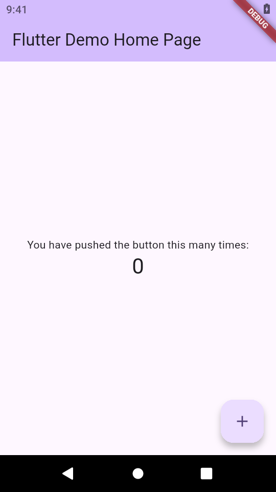
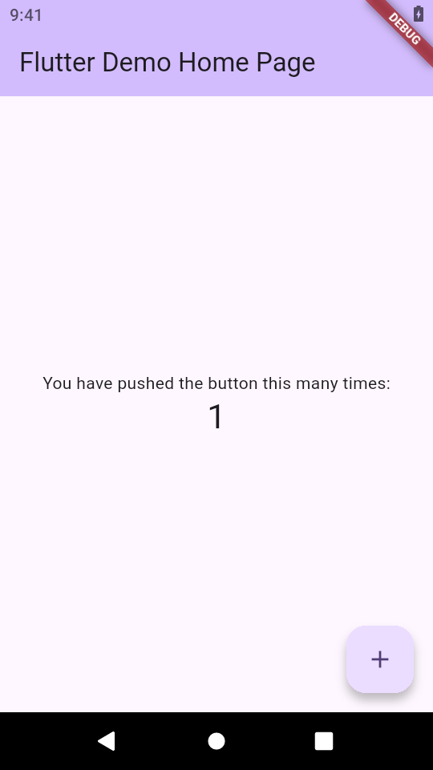

# 📱 agent-device demo on OpenMercatoCloud.com

An Android automation demo built and run on **[OpenMercatoCloud.com](https://OpenMercatoCloud.com)** using **[Callstack's agent-device](https://github.com/callstack/agent-device)**.

The demo launches Flutter's counter app in an Android emulator, presses the **Increment** button, verifies the counter values, and saves screenshots and accessibility snapshots for review. ✅

## ⚛️ React Native Android demo

There is also a [React Native counter demo](examples/react_native_counter/README.md)
hosted natively in Expo Go, with Increment, Reset and repeatable screenshot QA.
Run `npm run android:react-native:screenshots` after installing its dependencies.
Both demos use **agent-device on the Android emulator**, not browser automation.

## 📸 Screenshots from the verified run

These screenshots were captured from the running Android app with agent-device. Each image is **540 × 960**, and its counter value was checked against the app's accessibility tree.

| 🟣 Starting at 0 | 👆 Incremented to 1 | 🎉 Reached 5 |
| :---: | :---: | :---: |
|  |  |  |

🔎 Inspect the [run manifest](artifacts/android-counter/2026-09-20T12-57-14.212Z/manifest.json), [command log](artifacts/android-counter/2026-09-20T12-57-14.212Z/commands.json), or [all captured evidence](artifacts/android-counter/2026-09-20T12-57-14.212Z/).

## 🤖 What the automation does

1. Waits for Android to finish booting.
2. Installs the Flutter APK and launches a fresh counter session.
3. Verifies **0** and saves the first screenshot.
4. Finds **Increment** by its accessibility label and presses it.
5. Verifies each counter change and captures **1** and **5**.
6. Saves PNGs, accessibility snapshots, and a command log, then closes the session.

The script checks the actual counter after every press. On this software emulator, it retries a touch only when the value remains unchanged and fails on unexpected values.

## 🚀 Run it in this OpenMercatoCloud workspace

The required Flutter, Java, Android SDK, emulator, and agent-device tools are installed in this workspace, and the demo APK has been built.

From the repository root, start the emulator if it is not already running:

```bash
npm run android:emulator
```

In another terminal, run the screenshot automation:

```bash
npm run android:screenshots
```

📁 Each run saves its results in a new timestamped directory under `artifacts/android-counter/`.

To choose an output directory:

```bash
npm run android:screenshots -- artifacts/my-demo-run
```

⏳ This workspace uses software emulation because KVM is unavailable to the container. Startup can take several minutes. The local SDKs and built APK are ignored by Git; a fresh clone needs those tools installed and the APK rebuilt.

## 🧰 Explore the demo

| File | Purpose |
| --- | --- |
| [Flutter counter app](examples/flutter_counter/lib/main.dart) | The mobile app being automated |
| [Screenshot automation](scripts/android-screenshots.mjs) | agent-device commands, counter checks, and saved evidence |
| [Emulator launcher](scripts/android-emulator.sh) | Starts the headless Android emulator |
| [Toolchain environment](scripts/android-env.sh) | Configures the local Android, Java, and Flutter tools |
| [Detailed setup and build guide](examples/flutter_counter/README.md) | Tool versions, APK rebuild steps, and container notes |

## 🌐 Web workspace

The repository also includes the original Next.js starter. Run `npm run dev` to serve it on port **3000**. The Android demo lives separately in `examples/flutter_counter/`.

---

☁️ Run on [OpenMercatoCloud.com](https://OpenMercatoCloud.com) · 🤖 Automated with [agent-device](https://github.com/callstack/agent-device) · 💙 Built with Flutter

## Agent pipeline

[Pipeline settings](.ai/agentic.config.json) select the
[agent-device Android provider](.ai/browsers/agent-device.md). With the emulator
running, use:

```bash
sh .ai/scripts/test-env-up.sh
bash .ai/scripts/agent-device.sh snapshot
sh .ai/scripts/test-env-down.sh
npm run android:screenshots -- .ai/qa/artifacts_counter
```

Up checks APK freshness and live device access, reuses the emulator, and writes
ignored `.ai/qa/test-env.json`. Down releases only its app session. Close that
session before the independent screenshot runner. Start the emulator with
`npm run android:emulator`; rebuild a stale APK with
`bash .ai/scripts/android-build.sh` while the emulator is stopped.

Validation: `npm run lint`, `bash .ai/scripts/flutter-check.sh`, `npm run build`.
Android QA covers the Flutter example; web UI changes need a web environment.
GitHub operations require a remote and authenticated `gh`; labels are disabled
for now. See [SDLC.md](SDLC.md) for the process.
